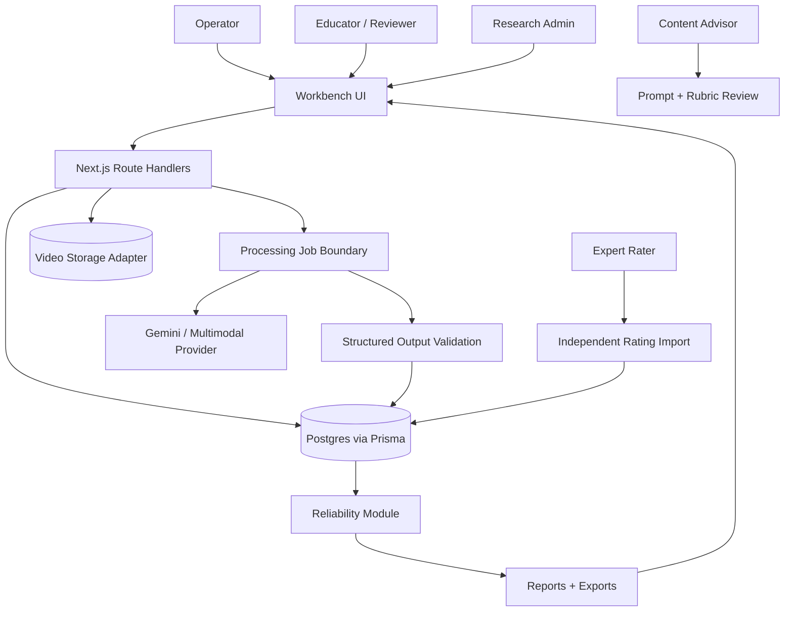
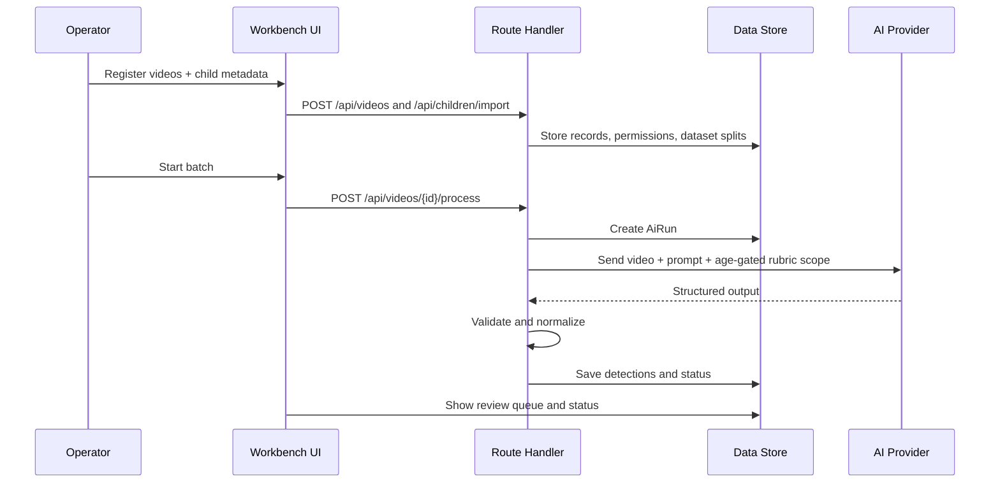
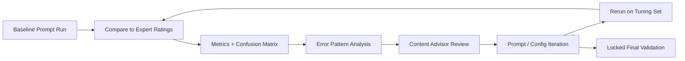
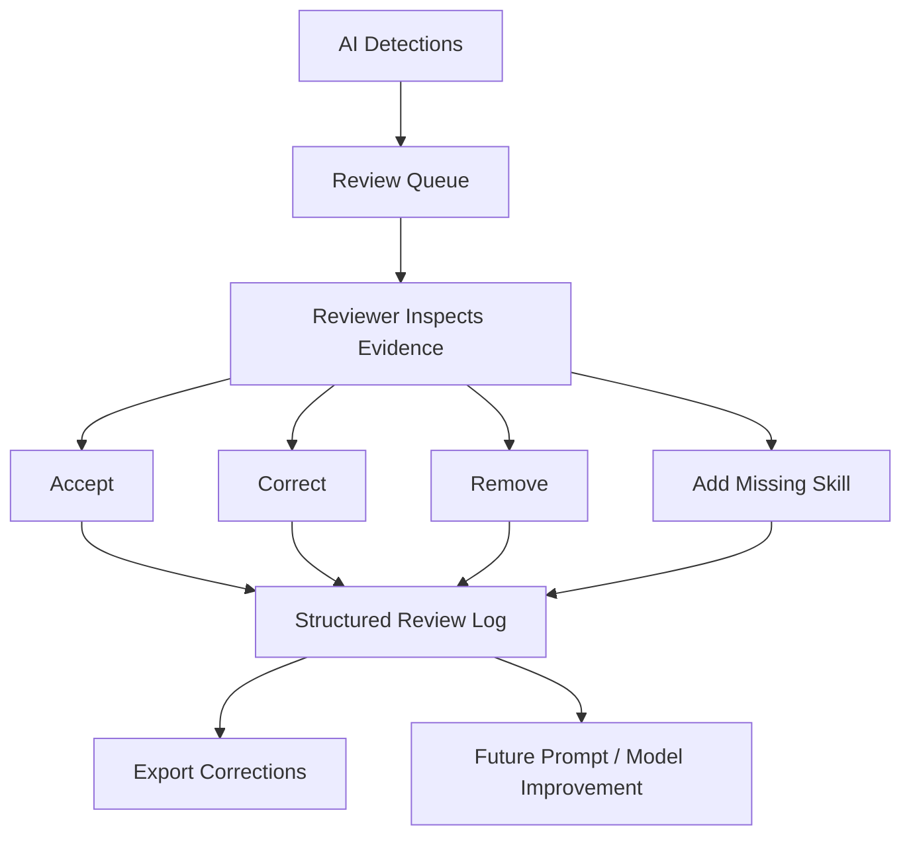

# Design: Assessment Reliability Workbench

Generated with the Kiro spec-driven workflow.

Source requirements: `docs/specs/assessment-reliability-workbench/requirements.md`

## Overview

The Assessment Reliability Workbench is a lean Next.js App Router application for an AI-assisted HELP assessment video workflow. It replaces a manual one-video-at-a-time Gemini prompt process with a traceable batch pipeline, structured outputs, human review, prompt/model experiment tracking, and reliability benchmarking against expert raters.

The design keeps the first implementation in one deployable web app for speed, while isolating AI orchestration, storage, validation, export, and reliability logic so those pieces can move to dedicated services later.

```txt
Next.js App Router
|-- Workbench UI
|-- Route handlers / server actions
|-- Domain validation
|-- Storage adapter
|-- AI runner boundary
|-- Reliability metrics module
|-- Export serializers
`-- Prisma/Postgres-ready data model
```

## Design Goals

- Automate batch processing without losing video, prompt, rubric, and dataset traceability.
- Scope HELP skills by child age and metadata before model evaluation.
- Treat AI scoring as decision support, not final assessment authority.
- Make prompt/model iteration measurable through before/after reliability metrics.
- Separate independent expert ratings from reviewer overrides.
- Support the RFP milestones with exportable evidence.
- Keep the MVP lightweight enough to meet the July 31 deadline.

## Non-Goals

- Full replacement of Acelero's existing internal assessment platform.
- Fully autonomous final scoring.
- Custom model training as the primary MVP strategy.
- Production multi-tenant SaaS infrastructure.
- Synthetic video generation as a validation substitute.

## System Context



## Runtime Architecture

### Next.js App

The app owns the user-facing workbench, route handlers, server-side validation, and prototype workflows.

Primary routes:

```txt
app/
  page.tsx
  dashboard/page.tsx
  videos/page.tsx
  videos/[videoId]/page.tsx
  review/page.tsx
  reliability/page.tsx
  prompts/page.tsx
  settings/page.tsx
  api/
    videos/route.ts
    videos/[videoId]/route.ts
    videos/[videoId]/process/route.ts
    ai-runs/route.ts
    prompts/route.ts
    prompts/[promptVersionId]/route.ts
    reliability/route.ts
    rubric/route.ts
    children/import/route.ts
    human-ratings/import/route.ts
    review-overrides/route.ts
    exports/[exportType]/route.ts
```

### Data Layer

The MVP can use seeded in-memory data for demo flows, but the production-shaped model lives in Prisma and should map cleanly to Postgres.

Core entities:

| Entity | Purpose |
| --- | --- |
| `Child` | Child identifier, age/context fields, and minimal metadata needed for age-gated scoring. |
| `Video` | Observation video, storage reference, permission status, dataset split, child match, and processing state. |
| `RubricSkill` | HELP skill metadata: code, domain, strand, age range, definition, and scoring guidance. |
| `RubricVersion` | Version context for rubric/import changes that affect scoring. |
| `PromptVersion` | Immutable prompt/model/schema configuration used by AI runs. |
| `AiRun` | One model execution against one video using one prompt/model configuration. |
| `AiSkillDetection` | Structured model suggestion for one skill in one AI run. |
| `HumanRating` | Independent expert rating for reliability calculations. |
| `ReviewOverride` | Human-in-the-loop correction, acceptance, removal, or added missing skill. |
| `ReliabilityReport` | Metrics and error patterns for a prompt version and dataset split. |
| `ProcessingBatch` | Optional grouping of video processing jobs for batch status and reporting. |

### AI Runner Boundary

The AI runner is a backend-only service boundary. It should not import React components or client-side code.

Primary file:

```txt
lib/ai/run-video-assessment.ts
```

Provider files:

```txt
lib/ai/mock-provider.ts
lib/ai/gemini-provider.ts
```

Processing steps:

1. Load video, child context, permission status, dataset split, rubric version, and prompt version.
2. Build age-gated HELP skill scope.
3. Compose model input using prompt text, scoring definitions, child context, and video reference.
4. Call the selected provider.
5. Validate structured output with Zod.
6. Normalize scores into the internal credit taxonomy.
7. Persist raw response metadata, normalized detections, evidence, confidence, and review flags.
8. Update AI run, video, and batch status.

AI provider interface:

```ts
type RunVideoAssessmentInput = {
  videoId: string;
  promptVersionId: string;
  forceRetry?: boolean;
};

type RunVideoAssessmentResult = {
  aiRunId: string;
  status: "COMPLETED" | "FAILED";
  detectionCount: number;
  reviewFlagCount: number;
};
```

### Structured Output Schema

The provider output must validate before it is accepted.

```ts
type AiAssessmentOutput = {
  videoId: string;
  promptVersionId: string;
  modelName: string;
  detections: Array<{
    skillId: string;
    skillCode: string;
    domain: string;
    strand: string;
    suggestedCredit: "CREDIT" | "PARTIAL_CREDIT" | "NO_CREDIT" | "NOT_OBSERVED" | "UNCERTAIN";
    confidence: number;
    evidenceSummary: string;
    timestamp?: string;
    rationale: string;
    atypicalDevelopmentFlag?: boolean;
    familyDiscussionFlag?: boolean;
    dalFields?: Record<string, unknown>;
    reviewFlags: string[];
  }>;
};
```

HELP scoring labels from source materials should be mapped into this normalized taxonomy for comparison. The UI can display HELP-facing labels while reliability functions operate on normalized values.

### Rubric and Skill Scope Service

The rubric service converts the full HELP skill repository into the relevant age-gated scope for each child/video.

```ts
type SkillScopeInput = {
  childId?: string;
  ageMonthsAtObservation?: number;
  observationDate?: string;
  rubricVersionId: string;
};

type RubricSkillScope = {
  rubricVersionId: string;
  skills: RubricSkill[];
  warnings: string[];
};
```

Responsibilities:

- Filter skills by min/max age range.
- Include domain, strand, definition, and scoring guidance.
- Surface missing or ambiguous rubric data.
- Preserve rubric version context for historical runs.
- Keep prompt context small enough for reliable model behavior.

### Prompt Version Registry

Prompt versions are immutable once used by an AI run.

```ts
type PromptVersionInput = {
  name: string;
  version: string;
  promptText: string;
  modelName: string;
  modelConfig: {
    temperature?: number;
    topP?: number;
    maxTokens?: number;
    structuredOutput: boolean;
    schemaVersion: string;
  };
  changeNotes: string[];
  parentPromptVersionId?: string;
};
```

Prompt records support:

- Current/candidate/archived status.
- Before/after reliability metrics.
- Structured output schema version.
- Change rationale and content advisor notes.
- Promotion audit trail.

### Human Review Workflow

Review is centered on a video and its AI detections.

UI responsibilities:

- Show video reference or player.
- Show child age/context and matched metadata.
- Show AI detections with skill, score, confidence, evidence, and flags.
- Show HELP definition and scoring guidance for the selected skill.
- Allow accept, correct, remove, add missing skill, and note actions.
- Keep independent expert rating workflows separate from AI-visible review workflows.

Review override interface:

```ts
type ReviewOverrideInput = {
  aiDetectionId?: string;
  videoId: string;
  skillId: string;
  action: "ACCEPT" | "CORRECT" | "REMOVE" | "ADD_MISSING";
  correctedCredit?: CreditAssignment;
  reviewerNote?: string;
};
```

### Reliability Module

Reliability functions must remain portable, deterministic, and testable.

```ts
type ReliabilityComparison = {
  videoId: string;
  skillId: string;
  domain: string;
  strand?: string;
  promptVersionId: string;
  datasetSplit: "training" | "calibration" | "validation";
  aiCredit: CreditAssignment;
  humanCredit: CreditAssignment;
};

type ReliabilityMetrics = {
  exactAgreement: number;
  agreed: number;
  totalComparisons: number;
  cohenKappa?: number;
  krippendorffAlpha?: number;
  confusionMatrix: Record<string, Record<string, number>>;
  target: number;
  targetMet: boolean;
};
```

Reliability reports should include:

- Exact agreement.
- Cohen's kappa where appropriate.
- Krippendorff's alpha where appropriate.
- Confusion matrix.
- Metrics by domain, strand, score type, prompt version, and dataset split where sample size allows.
- Top disagreement patterns.
- Gap analysis if target is not met.

### Export Layer

Exports support analysis, audit, handoff, and future integration.

Supported export types:

- `ai-outputs`
- `human-ratings`
- `review-overrides`
- `reliability`
- `prompt-log`
- `batch-status`

Export rules:

- CSV and JSON should share stable field names.
- Exports should include IDs for video, child, skill, prompt version, model config, rubric version, and dataset split where relevant.
- UI-only presentation fields should not leak into export schemas.
- Export scope should be explicit before data leaves the system.

## Data Flows

### Intake and Batch Processing



### Reliability Experiment Loop



### Human Review Loop



## UI Structure

### `/dashboard`

Purpose: Milestone and project operating view.

Shows:

- Total videos.
- Permissioned/blocked videos.
- Processed videos.
- Needs-review count.
- Current prompt version.
- Current agreement and target status.
- Recent processing activity.
- Review queue preview.

### `/videos`

Purpose: Video registry and batch control.

Shows:

- Video list.
- Child match state.
- Permission status.
- Dataset split.
- Processing status.
- AI run count.
- Review priority.
- Actions to register, process, retry, and open review.

### `/review`

Purpose: Human-in-the-loop queue.

Shows:

- Prioritized items by low confidence, disagreement, missing evidence, age-gate concern, DAL issue, and present-vs-emerging mismatch.
- Review controls for accept/correct/remove/add.
- Reviewer notes and override history.

### `/videos/[videoId]`

Purpose: Deep review for one observation.

Shows:

- Video or preview reference.
- Child metadata.
- AI detections.
- Selected skill definition and scoring rules.
- Evidence and timestamp.
- DAL details where available.
- Human rating comparison where appropriate.

### `/reliability`

Purpose: Reliability benchmarking and error analysis.

Shows:

- Exact agreement.
- Cohen's kappa.
- Krippendorff's alpha where available.
- Confusion matrix.
- Trend by prompt version.
- Grouped agreement by domain/strand/score type.
- Top disagreement patterns.
- Held-out validation target status.

### `/prompts`

Purpose: Prompt/model experiment registry.

Shows:

- Prompt versions and status.
- Model configuration.
- Structured output schema version.
- Before/after metrics.
- Change notes.
- Candidate vs current comparison.
- Promotion controls for authorized users.

### `/settings`

Purpose: Deployment, provider, and integration readiness.

Shows:

- Environment readiness.
- Storage provider status.
- AI provider status.
- Auth mode.
- Export/API configuration notes.

## API Design

Existing/proposed route handlers:

| Route | Method | Purpose |
| --- | --- | --- |
| `/api/videos` | `GET` | List videos with filters. |
| `/api/videos` | `POST` | Register video metadata and storage reference. |
| `/api/videos/[videoId]` | `GET` | Fetch video detail and latest run/review summary. |
| `/api/videos/[videoId]/process` | `POST` | Start or retry processing for one video. |
| `/api/ai-runs` | `GET` | List AI runs by video, prompt, status, or batch. |
| `/api/prompts` | `GET` | List prompt versions. |
| `/api/prompts` | `POST` | Create prompt version. |
| `/api/prompts/[promptVersionId]` | `GET` | Fetch prompt version detail. |
| `/api/prompts/[promptVersionId]` | `PATCH` | Promote/archive prompt version where allowed. |
| `/api/reliability` | `GET` | Fetch reliability reports. |
| `/api/reliability` | `POST` | Calculate and store a reliability report. |
| `/api/rubric` | `GET` | Fetch rubric skills or age-gated scope. |
| `/api/children/import` | `POST` | Import child metadata rows. |
| `/api/human-ratings/import` | `POST` | Import independent expert ratings. |
| `/api/review-overrides` | `POST` | Store review acceptance/correction/removal/addition. |
| `/api/exports/[exportType]` | `GET` | Export CSV or JSON. |

## Security and Privacy Design

- Use server-only environment variables for database, storage, Gemini, and auth secrets.
- Keep provider calls in backend-only modules.
- Avoid storing unnecessary child PII.
- Track video permission status and dataset split.
- Deny restricted actions without the required role.
- Preserve audit metadata for imports, exports, prompt changes, AI runs, and review actions.
- Keep independent rating workflows separate from AI-visible review workflows.

## Deployment Design

Recommended MVP path:

- Next.js app deployed on Vercel or equivalent.
- Postgres for durable data.
- Prisma as ORM.
- S3-compatible storage, Cloudflare R2, or Vercel Blob for video files.
- Gemini as multimodal provider behind `lib/ai`.
- Background jobs via a simple queue first; Inngest or Trigger.dev if production runtime limits require it.

Deployment should preserve API/export compatibility so future integration with Acelero's internal assessment platform can happen through structured records rather than a rewrite.

## Milestone Mapping

| RFP Milestone | Design Evidence |
| --- | --- |
| Kickoff and requirements alignment | Requirements, validation protocol, data intake checklist, architecture plan. |
| Working prototype / proof of concept | Batch video processing, age-gated rubric scope, structured AI output, CSV/JSON exports. |
| First reliability benchmark | Reliability report, comparison rows, confusion matrix, error pattern analysis. |
| Human review interface complete | Review queue, review detail, accept/correct/remove/add actions, override export. |
| Final reliability validation | Locked prompt/model config, held-out validation run, reproducible final report. |
| Final delivery and handoff | Technical docs, operator guide, prompt log, exports, handoff package. |

## Key Risks and Mitigations

| Risk | Mitigation |
| --- | --- |
| Limited permissioned videos | Use real expert-scored videos for validation; use small data for evaluation and prompt tuning, not broad training claims. |
| Scoring subjectivity | Escalate ambiguous rules to content advisor; track near-miss categories separately. |
| Present vs emerging confusion | Add explicit rubric examples and analyze this mismatch as a top error pattern. |
| Overloaded prompt context | Age-gate skills and keep model context constrained to relevant definitions. |
| Reliability target not met | Report exact gap by data, metric, prompt/model, and scoring ambiguity; preserve reproducible evidence. |
| Scope pressure | Prioritize reliability pipeline, batch processing, review workflow, exports, and handoff over cosmetic dashboard additions. |

