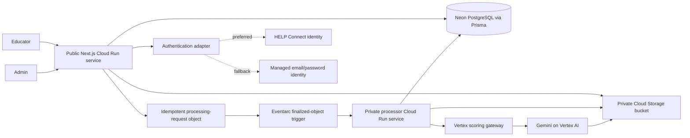
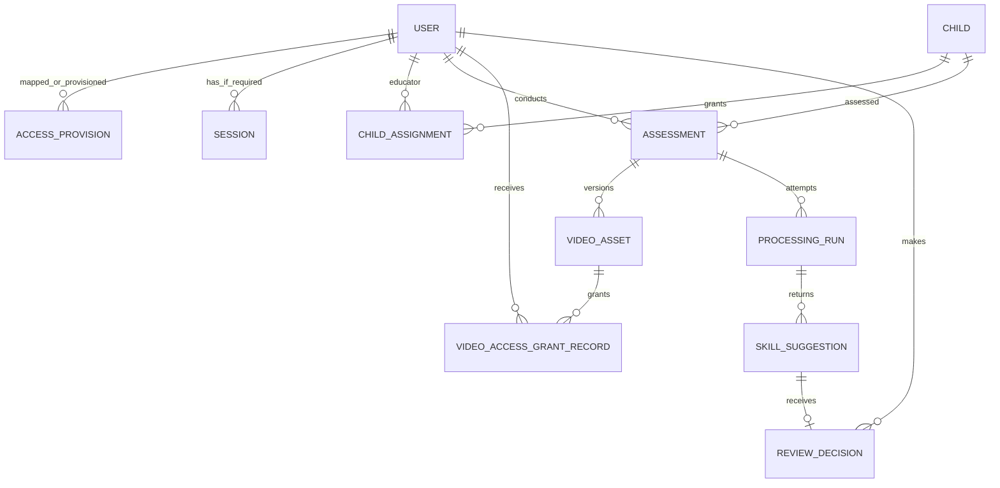
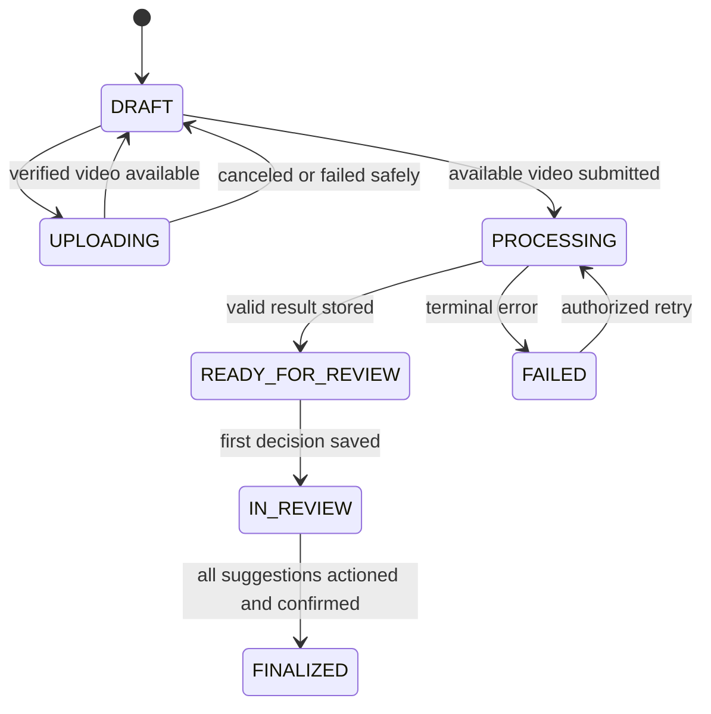
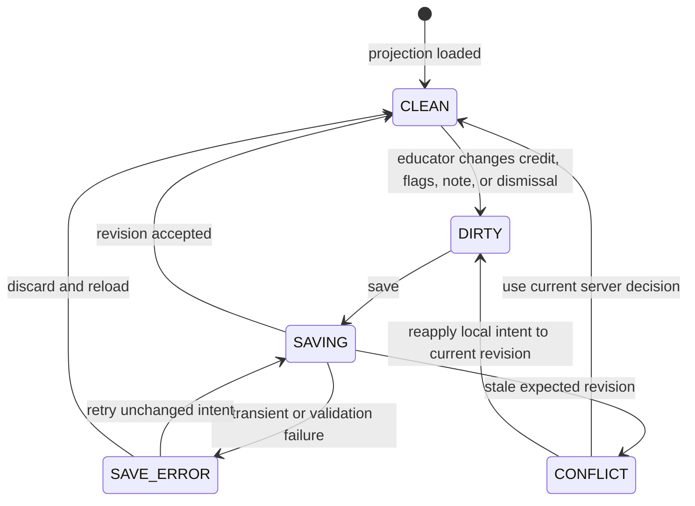

# Design: HELP Review Pilot Platform

Generated with the Kiro spec-driven workflow.

Source requirements: `docs/specs/help-review-production-platform/requirements.md`

## Scope Boundary

This design implements the July 10 pilot workflow, not the earlier Assessment Reliability Workbench.

The Lovable application supplies the interaction reference for the review and summary screens. It is intentionally not copied as application logic: its video player is simulated, several visible actions are not wired, and its summary uses preset data rather than the current session state. Production code must make those interactions real and persistent.

Authentication follows a selection rule rather than the earlier magic-link assumption: first reuse HELP Connect's current sign-in if its interface and ownership model support the pilot; otherwise use administrator-provisioned email/password through one approved managed identity service. The selected deployment architecture is Google Cloud Run, Cloud Storage, Eventarc, Vertex AI, Artifact Registry, and Secret Manager, with Neon PostgreSQL retained behind Prisma in the current environment.

The accepted images in `ui-ux-screens/` are the visual-state catalogue for this design. Their composition, interaction hierarchy, responsive intent, and feedback states are implementation targets. Their synthetic values, unresolved labels, conditional flags, and fallback sign-in fields are not production data contracts. The requirements document wins whenever an image conflicts with authorization, privacy, or a decision gate.

### Design Goals

1. Make the Educator's next valid action obvious from sign-in through finalization without introducing a dashboard.
2. Keep AI suggestions visibly provisional and preserve the Educator as the final decision maker.
3. Make long-running and failed work resumable rather than browser-session dependent.
4. Enforce assignment-aware access at every server boundary while disclosing as little protected-record information as possible.
5. Use one compact, work-focused responsive system across Educator and Admin routes.
6. Keep identity, object storage, and scoring integrations replaceable at a narrow boundary, without building unused provider frameworks.
7. Ship only approved content contracts. Conditional controls are absent, not disabled teasers.

Storage, persistence, dispatch, identity, and scoring use small interfaces so local development and the Google Cloud deployment exercise the same educator workflow without making the browser aware of provider details.

## System Architecture



The diagram shows alternatives, not two simultaneous sign-in systems. The application owns:

- Pilot access provisioning, the mapping from the selected external identity to the two local roles, child assignments, and application sessions only when the selected identity contract requires them.
- Assessment intake and private video references.
- Durable processing status.
- Validation and persistence of scoring results.
- Educator review decisions and the final summary.

The current Vertex gateway owns:

- Prompt and model execution.
- HELP skill detection and draft scoring.
- Confidence, uncertainty, evidence, and other output fields agreed in the service contract.

The browser never calls Vertex AI or the processor directly. It uploads the source video to the private bucket through a server-issued resumable session and reads only persisted application status.

The durable trigger is deliberately small: Start processing first persists one `QUEUED` run, then creates `processing-requests/{runId}.json` with a generation-zero precondition. Eventarc delivers the Cloud Storage finalization event to the IAM-private processor. Duplicate object events and repeated Start commands resolve to the same run, and the processor transactionally claims work before invoking Vertex. This avoids a separate queue product while retaining durable delivery, retry, browser independence, and independent processor scaling.

## HELP Connect And Google Cloud Ownership Boundary

- Confirm HELP Connect's current identity provider or protocol before designing credential tables or sign-in routes.
- Prefer the same stable user identity and sign-in experience already used by HELP Connect when the pilot can consume it safely.
- If a standalone credential path is required, use an approved managed email/password identity service rather than implementing password hashing and recovery in the application.
- Keep roles and child assignments in the pilot authorization layer unless HELP Connect explicitly supplies an equivalent contract.
- Keep environment configuration, Terraform, container artifacts, data migration instructions, cost visibility, and operational runbooks transferable to the named HELP Connect/Google Cloud technical and budget owners rather than a developer's personal account.
- The current development project proves the topology but does not itself constitute organization acceptance for real child data. Project/folder ownership, billing, region, retention, incident response, and named operators remain handoff gates.

## Existing Repository Disposition

The committed baseline was a useful historical prototype, but it was the wrong product shell for the revised scope. The cleanup removed that dashboard-first runtime; production implementation must not reintroduce it.

| Existing area | Treatment |
|---|---|
| Next.js, TypeScript, Zod, and test setup | Keep |
| Legacy buttons, badges, charts, and workbench layout primitives | Removed; add back only a small primitive that the pilot directly needs |
| `lib/help-review/domain.ts` concepts | Keep the four credits and supported decision validation; remove unconfirmed concepts |
| Invented HELP review fixture and in-memory repository | Removed; introduce sanitized fixtures or a test adapter only when a current contract/test requires them |
| `/dashboard`, `/videos`, `/reliability`, `/prompts`, and workbench `/settings` | Removed from the pilot application |
| Old reliability, prompt, human-rating, export, rubric, and video APIs | Removed |
| `lib/data.ts` seeded workbench data | Removed |
| Reliability metrics, charts, prompt records, and export center | Removed from the pilot dependency graph |
| Expanded production schema containing batch, research, DAL, reliability, export-job, and six-role models | Replaced with a lean two-role schema; neutral authentication mapping remains pending Task 1.5 |
| Lovable URL and supplied screenshot | Keep as external design references; the screenshot is isolated at `references/lovable-review-desktop.png` |

The removed mockup remains recoverable from Git history. Do not copy it into a `legacy` runtime folder; that would keep the wrong concepts searchable and easy to reuse accidentally.

## Application Routes

### Authentication

```txt
/sign-in
/auth/callback     # only when required by the selected identity provider
```

Password setup and recovery should use provider-hosted flows when the fallback provider supports them. Add application-owned auth routes only when the confirmed provider contract requires them; do not publish both HELP Connect and fallback-password routes.

### Educator

```txt
/children
/children/[childId]
/assessments
/assessments/new?childId=[childId]
/assessments/[assessmentId]/processing
/assessments/[assessmentId]/review
/assessments/[assessmentId]/summary
/assessments/[assessmentId]/final
```

An Educator lands on `/children`. There is no educator dashboard.

### Route Resolution

Every assessment row resolves its next action from authoritative status:

| Assessment state | Primary destination | Primary label |
|---|---|---|
| `DRAFT` with no complete upload | `/assessments/new?childId=...&assessmentId=...` | `Continue upload` |
| `DRAFT` with available video | `/assessments/new?childId=...&assessmentId=...` | `Start processing` |
| `UPLOADING` | Intake route for that draft | `View upload` |
| `PROCESSING` | `/assessments/[id]/processing` | `View status` |
| `FAILED` | `/assessments/[id]/processing` | `Review failure` |
| `READY_FOR_REVIEW` | `/assessments/[id]/review` | `Start review` |
| `IN_REVIEW` with remaining items | `/assessments/[id]/review` | `Continue review` |
| `IN_REVIEW` with no remaining items | `/assessments/[id]/summary` | `Finish review` |
| `FINALIZED` | `/assessments/[id]/final` | `View final` |

Route handlers re-read state before rendering or mutating. A stale row link redirects to the current valid destination after authorization rather than operating on stale browser state.

### Minimal Admin

```txt
/admin/access
/admin/jobs
```

`/admin/access` covers pilot access provisioning and Educator-child assignments. Credential setup, verification, and recovery remain with the selected identity provider. `/admin/jobs` shows failed or stuck pilot processing and retry. A separate roster-import page is added only if the agreed child-data source requires it. Neither Admin route grants ordinary video playback or review access.

## Component And Service Boundaries

The Next.js application uses server components for authorized page projections and small client islands for file transfer, playback, polling, review editing, dialogs, and responsive disclosure. Route handlers call application services; they do not query Prisma or external providers directly.

| Boundary | Responsibility | Must not do |
|---|---|---|
| `IdentityAdapter` | Start/complete selected sign-in, validate provider session, sign out, and return a stable provider subject | Store passwords, trust unverified browser claims, or expose both identity modes |
| `AuthorizationPolicy` | Enforce active user, role, active assignment, record ownership/state, and Admin-only operations | Rely on hidden navigation as authorization |
| `ChildRepository` | Return the minimum assignment-scoped child projection and assessment history | Return a global roster to Educators |
| `AssessmentService` | Create idempotent drafts, resolve next route, enforce transitions, derive progress, and finalize | Accept browser-calculated totals or skip current-state checks |
| `VideoStorage` | Create approved uploads, verify completion/metadata, issue authorized short-lived playback, and delete per approved policy | Persist temporary URLs or put protected identifiers in public object paths |
| `ScoringGateway` | Submit and observe one confirmed scientist contract | Run/edit prompts or return raw provider errors to the browser |
| `ProcessingCoordinator` | Create a run, enqueue/observe it durably, apply backoff/timeouts, and serialize terminal result persistence | Depend on browser polling to make scoring progress |
| `ScoringResultValidator` | Validate schema version, run identity, credits, skill identity, evidence, uncertainty, and optional approved flags atomically | Persist a partial result that looks reviewable |
| `ReviewService` | Build the review projection, save revision-checked decisions, and derive summary/final views | Overwrite stale edits or mutate finalized records |
| `AdminService` | Provision/deactivate access, manage assignments, list supportable runs, and create eligible retries | Own credentials or grant Admin implicit child/video access |
| `SupportRecorder` | Retain purpose-specific actor/time/reference records for playback grants and Admin changes | Become a generalized analytics or surveillance event stream |

### UI Composition

The implementation uses Tailwind CSS 4 as the only application styling layer and selected shadcn/ui primitives as the accessible control foundation. HELP Review semantic tokens live in `app/globals.css`; route and component composition stays in colocated utility classes. The system keeps the approved Georgia headings, system body type, teal/navy identity, restrained semantic colors, flat surfaces, 6 px corners, and compact operational density. It does not use DaisyUI, gradients, dark mode, decorative page cards, or a parallel legacy selector layer.

shadcn/ui is intentionally limited to controls whose interaction and accessibility behavior benefit from a maintained primitive: buttons, form fields, alerts, dialogs, tabs, disclosure, progress, badges, skeletons, separators, and tooltips. Domain components such as the review workspace, suggestion groups, evidence player, assessment summary, and Admin workspaces remain application-owned compositions. Shared product patterns are implemented in `components/ui/app-patterns.tsx`, while `lib/utils.ts` provides the class merge boundary.

Responsive behavior is expressed at the component boundary rather than through page-wide CSS overrides. Mobile review uses explicit list and full-height editor modes, tablet review uses the two-column reference composition, and desktop preserves the grouped list with contextual video/editor rail. Playwright smoke coverage checks desktop and 360 px navigation, mobile editor reachability, Admin access, horizontal overflow, serious/critical axe violations, and approved screenshot baselines. The three committed visual smoke baselines are a migration guard, not a substitute for the still-open 45-state fixture and approval task.

| Component | Used by | Design behavior |
|---|---|---|
| `AppHeader` | All authenticated routes | Role-appropriate navigation, account menu, help, and sign-out; mobile collapses utilities without hiding the active section |
| `PageStatus` | Loading, empty, unavailable, and failure states | Icon, concise title, safe explanation, live status semantics, and one or two valid recovery commands |
| `AssessmentStatusBadge` | Child, assessment, processing, and Admin tables | Canonical label plus icon/text; never color-only |
| `ChildContextSummary` | Child, intake, review, summary, and final | Only approved identifier, age, observation date, and processing-permission context |
| `UploadController` | Intake | File picker/drop target, progress, resumable/retry state when supported, replace/remove, and duplicate-submit guard |
| `ProcessingTimeline` | Processing | Completed/current/pending/failed steps with server timestamps and live status announcement |
| `ReviewProgress` | Review and summary | Server-derived actioned/remaining totals and origin counts; stable dimensions during saves |
| `SuggestionGroups` | Review | Needs-review plus four credit groups, selected row, evidence markers, and saved/unsaved/conflict status |
| `EvidencePlayer` | Review | Accessible controls, byte-range playback, timestamp markers, selected evidence, and playback-grant restoration |
| `DecisionEditor` | Review | One primary credit, gated approved flags, note, dismiss, save/discard, and revision metadata |
| `SummaryTables` | Summary and final | Reconciled origin counts, domain-by-credit matrix, included items, dismissed items, and remaining items |
| `ConfirmDialog` | Finalization and destructive Admin operations | Focus trap, affected record, consequence text, explicit confirmation, and pending/error/success states |
| `AdminDataTable` | Access and jobs | Search/filter, stable columns, row details, narrow-width labeled rows, and distinct load/empty/error states |

## Educator Experience

### Child Selection

- Show only assigned active children.
- Use the approved identifier and minimum disambiguating context.
- Put `Upload observation` on the selected child's page.
- Do not expose internal model, reliability, or system configuration data.

### Intake And Upload

- Collect the child association and observation date.
- Show only approved contextual fields; do not ask the Educator to re-enter data already supplied by the roster.
- Accept one video and validate it against the confirmed service/storage limits.
- Show upload progress, retry, replacement, and a clear successful handoff to processing.
- Do not show batch controls.

### Processing

- Show `queued`, `processing`, `ready`, and `failed` states.
- Explain that the Educator can leave and return.
- Do not invent a completion estimate before the scientist service provides a reliable one.
- Poll a lightweight application status endpoint unless the confirmed backend contract gives the application a push mechanism.

### Review

Follow the Lovable hierarchy:

1. Sticky header with credit-group counts, remaining action count, progress, and `Finish & review`.
2. Main list grouped into `Needs your review`, `Present`, `Emerging`, `Not observed`, and `Not applicable`.
3. Video/context/editor rail on desktop and an intentional stacked order on smaller screens.
4. Item rows containing skill identity, domain/strand, timestamps, confidence or uncertainty, evidence expansion, status, and supported actions.
5. Selected-item editor containing four credit choices, approved add-on flags, and note.

Differences from the prototype that production must enforce:

- `Edit`, `Comment`, `Dismiss`, add-on flags, and notes must perform real state changes.
- Video controls and evidence seeking must use the uploaded video.
- Saved decisions must survive refresh and sign-in return.
- The summary must be calculated from the current saved decisions, not fixture defaults.
- `Finish & review` may open the summary, but final confirmation remains blocked while suggestions are unactioned.

### Summary And Finalization

- Show accepted, overridden, independently scored, and dismissed counts.
- Show per-domain totals across the four primary credits.
- Show each included skill, final credit, and decision origin.
- Let the Educator return to review before final confirmation.
- After confirmation, show a read-only final view.
- Do not build PDF or export UI until the required final format is confirmed.

## Screen Design Catalogue

Each accepted screen has a deterministic test state named after its numeric identifier, for example `screen-23-review-save-failure`. Test states use sanitized data and provider fakes; production states arise only from authoritative service responses. Text in the images is illustrative unless it is named as product language in requirements.

### Authentication And Access

| Screen | Route and state | Implementation design |
|---|---|---|
| `01-sign-in.png` | `/sign-in`; fallback identity idle/submitting | Centered compact authentication surface outside the authenticated shell. `IdentityAdapter` owns submit and recovery handoff. Password is never echoed in server-rendered HTML, URL, telemetry, or retained state. Replace the entire form with the HELP Connect handoff when that path is selected. |
| `10-auth-access-unavailable.png` | `/sign-in`; invalid provider result, credentials, or inactive provision | Render one generic inline/page error keyed by a safe error code. Keep email only for correction, clear password, restore focus to the error summary, and rate-limit repeat submits. No user, provision, or assignment lookup detail enters the response. |
| `11-session-expired.png` | Any protected route; session invalid during navigation/mutation | Global auth guard maps invalid session to an interruption page. Store a server-validated relative return path and a non-sensitive assessment reference; after sign-in, re-run all authorization and current-state resolution before redirecting. |
| `15-resource-unavailable.png` | Protected child/assessment/video/final route; forbidden or not found | One reusable `PageStatus` for `403`/`404` equivalence. Log the internal reason with a safe correlation ID, but render no record-specific detail beyond context already authorized in the prior view. |
| `40-mobile-sign-in.png` | `/sign-in`; fallback at 360-767 px | Single column, full-width fields and primary action, fixed minimum touch targets, no viewport-font scaling, utilities at the bottom, and visible focus/error content above the keyboard-safe submit region. |

### Assigned Children And Assessments

| Screen | Route and state | Implementation design |
|---|---|---|
| `02-assigned-children.png` | `/children`; populated | Server-render assignment-scoped rows. Desktop table columns are identifier, age, last observation, status/progress, and next action. Search is client-side only for the loaded page or server-side through the same assignment policy; it never broadens authorization. |
| `12-assigned-children-empty.png` | `/children`; successful empty projection | Use `PageStatus` inside the normal shell, not an error alert. `Refresh assignments` revalidates the projection; Admin guidance is configured support content, not a roster link. |
| `13-children-load-error-v2.png` | `/children`; transient query failure | Replace the data region with an error state while retaining the shell. Retry uses cache revalidation/new request; sign-out remains available. Do not render cached rows as current unless explicitly labeled and approved for offline use, which is out of scope. |
| `14-child-detail-history-v2.png` | `/children/[childId]`; assigned child | Header shows minimum child context and `Upload observation`. History rows reuse the route resolver so actions cannot disagree with state. Pagination is unnecessary until actual pilot volume requires it; do not load unrelated children. |
| `16-assessments-list.png` | `/assessments`; active/finalized/all | Assignment-scoped server query with status filter, safe identifier search, progress, observation date, updated time, and resolved next action. Tabs are URL-backed so refresh/back preserves the selected filter. |
| `34-mobile-assigned-children.png` | `/children`; populated mobile | Convert each row into an unframed labeled list item, not a nested card. Keep identifier/status/action in the first scan line, place secondary age/progress beneath, and keep one row action to avoid wrapping collisions. |

### Intake And Upload

| Screen | Route and state | Implementation design |
|---|---|---|
| `03-upload-observation.png` | Intake route; active transfer | `UploadController` owns local progress while the server owns upload session and completion. Show byte progress only when measurable. Persist draft before transfer; throttle visual updates; disable processing and duplicate file selection while the active contract forbids concurrency. |
| `17-upload-ready.png` | Intake route; verified object available | Display verified server metadata rather than browser-only values. Replace/remove call state-checked endpoints; `Start processing` sends an idempotency key and transitions only after a run exists. |
| `18-upload-validation-error.png` | Intake route; rejected before availability | Map Zod/storage validation codes to approved copy beside the file region. Client validation improves speed, but server validation remains authoritative. Clear the rejected file handle while preserving date and child binding. |
| `19-upload-network-failure.png` | Intake route; interrupted transfer | Preserve upload session/part state only if the selected storage adapter supports resume. Otherwise restart safely after invalidating the incomplete object. The UI labels incomplete bytes as not available and never enables processing. |
| `20-permission-blocked.png` | Intake route; child `processingAllowed !== true` | Resolve permission before issuing upload credentials. Replace upload controls with a locked `PageStatus`, retain safe child/date context, and provide return/Admin support. Direct upload/process endpoints enforce the same rule. |
| `35-mobile-upload.png` | Intake route; verified object mobile | Stack context, date, upload region, file controls, privacy status, and sticky bottom actions in reading order. The sticky region reserves space so it does not cover file/error content. |

### Processing

| Screen | Route and state | Implementation design |
|---|---|---|
| `04-processing.png` | `/assessments/[id]/processing`; queued/running | Page reads a lightweight status projection. Poll with visibility-aware backoff only while retryable active states exist; stop on ready, failed, auth loss, or unmount. Timeline steps derive from persisted timestamps rather than animation timers. |
| `21-processing-failed.png` | Processing route; terminal retryable failure | Show safe category and reference, file availability, and retry eligibility. Retry creates the next numbered `ProcessingRun` transactionally and uses the existing video only after rechecking access, permission, and asset availability. |
| `22-processing-ready.png` | Processing route; validated result committed | Ready is rendered only after all suggestions commit in one transaction. Counts come from stored suggestions. `Start review` resolves to the existing review session if review already began. |
| `36-mobile-processing.png` | Processing route; running mobile | Vertical timeline and filename remain visible; refresh and return actions use stable bottom controls. Backgrounding the tab changes polling frequency, not server work. |

### Review

| Screen | Route and state | Implementation design |
|---|---|---|
| `05-review-workspace.png` | `/assessments/[id]/review`; loaded desktop | Three-region work surface: grouped list, evidence/video, and decision editor, with compact header progress. Selection is URL/hash or client state scoped to the loaded projection. Original draft and current human decision are rendered as distinct fields. No decorative page cards or marketing composition. |
| `23-review-save-failure.png` | Review; decision mutation rejected/transient failure | Keep an editor-local draft and `saveState='error'`; server progress remains unchanged. Inline error names the failed action, exposes retry and discard/reload, and associates to the editor for assistive technology. |
| `24-review-video-unavailable.png` | Review; playback grant expired/unavailable | Player region becomes a recovery state while list/editor remain intact. `Restore video access` requests a new grant, restores the last allowed playback time, and revalidates current assignment before replacing the media source. |
| `25-review-conflict-v2.png` | Review; mutation returns `409` with current revision | Modal compares normalized local intent with current saved decision, not raw payloads. `Use current` replaces the editor draft; `Reapply mine` requires a deliberate second mutation against the returned revision. Focus returns to the edited skill. |
| `26-review-no-valid-results.png` | Review route; run invalid/empty by contract | Route returns a dedicated invalid-result projection, never an empty `SuggestionGroups`. Show safe category/reference, retained asset state, return action, and retry only when `ScoringRunPolicy` allows it. |
| `37-mobile-review-list.png` | Review; list mode mobile | Mobile uses two explicit modes: list/video and item editor. List mode keeps video, group navigation, selected evidence, and current status. Opening the editor preserves scroll, group, and playback state. |
| `38-mobile-review-editor.png` | Review; editor mode mobile | Full-height editor with back-to-list guard, skill/evidence summary, four radio choices, gated flag checkboxes, note, dismiss/discard, and save. The primary action remains visible without covering validation text. |
| `42-tablet-review-workspace.png` | Review; 768-1199 px | Use a two-column layout with list and combined video/editor region, or a controlled video/editor tab if width cannot support both. Preserve simultaneous context and avoid desktop controls shrinking below minimum sizes. |
| `44-review-loading.png` | Review; projection/player pending | Render final-size header, list-row, player, and editor skeletons with a single live loading announcement. Do not animate large regions indefinitely or render interactive placeholders. Resolve to loaded, invalid, unavailable, or generic resource state. |

### Summary And Final Record

| Screen | Route and state | Implementation design |
|---|---|---|
| `06-finish-review.png` | `/assessments/[id]/summary`; complete | Server derives all totals from current decisions in one projection. Header confirms completion; origin totals, domain matrix, and final items reconcile. Confirmation opens a dialog and sends the current assessment revision/idempotency key. |
| `27-summary-incomplete.png` | Summary route; remaining decisions | Same projection includes an ordered remaining-item list with deep links back to review selection. Confirmation stays absent/disabled server-side as well as visually. Returning to review cannot reset decisions. |
| `07-final-assessment.png` | `/assessments/[id]/final`; finalized desktop | Read-only projection is generated from finalized persisted decisions, not editable review state or fixtures. Show lock/read-only semantics, finalizer/time, counts, domain matrix, included skills, dismissed suggestions, and normal navigation. |
| `39-mobile-summary.png` | Summary; mobile | Use disclosure sections for domain and item detail while keeping completion, origin totals, remaining status, and final action visible. Sticky action area reserves content space and handles pending/error finalization. |
| `41-mobile-final-assessment.png` | Final; mobile | Single-column read-only record with collapsed detail groups, no decision inputs, and a full-width return action. Long skill/strand labels wrap without shrinking text based on viewport. |
| `43-tablet-summary.png` | Summary; tablet | Keep origin totals in a compact row, allow the domain matrix to scroll inside a labeled region only when necessary, and keep final actions in normal/sticky layout without occluding table content. |

### Minimal Admin

| Screen | Route and state | Implementation design |
|---|---|---|
| `08-admin-pilot-access.png` | `/admin/access`; populated | Server-render provision records and assignments. Filters are URL-backed. Provision form creates an access intent/provider handoff, never credentials. Row/details actions are policy checked and update the list after success. |
| `28-admin-access-empty.png` | Admin access; successful empty | Normal shell plus `PageStatus` and one provision action. Explain provider ownership in support copy outside credentials. No import/dashboard promotion unless the roster decision adds it. |
| `29-admin-access-load-error.png` | Admin access; transient read failure | Replace results with failure state, keep filters, disable row/provision mutations that depend on unknown current state, and retry the authoritative query. |
| `30-admin-deactivate-confirmation-v2.png` | Admin access; deactivation dialog | Dialog loads current user status/assignment count, states session/access impact, requires explicit confirmation, and uses a revision/idempotency key. On success revoke access according to the selected identity contract and refresh the row. |
| `31-admin-remove-assignment-v2.png` | Admin access; unassignment dialog | Dialog identifies only the selected Educator/child reference and current impact. Mutation revokes one assignment, records actor/time, and immediately causes subsequent assignment checks to fail. |
| `09-admin-processing-jobs.png` | `/admin/jobs`; failed/stuck results | Table plus details drawer. Query returns only safe support fields and computed retry eligibility. Attempt history is chronological; raw provider response and unrestricted model payload never enter the browser. |
| `32-admin-jobs-empty-v2.png` | Admin jobs; successful empty | Healthy empty state retains filters, last refresh, and manual refresh. It does not query/render every successful job merely to fill the page. |
| `33-admin-retry-confirmation-v2.png` | Admin jobs; retry dialog | Re-read run, assessment, asset, permission, active-run, and retry policy before confirmation and again in the transaction. Create one new attempt and preserve all prior attempt rows. |
| `45-admin-jobs-load-error.png` | Admin jobs; transient read failure | Distinct error projection with retry and no active row commands. Previously selected drawer closes or is clearly stale and non-actionable. |

### Shared Responsive System

- **Mobile, 360-767 px:** one content column; tables become labeled lists; review uses explicit list/editor modes; primary actions may be sticky only when bottom padding prevents occlusion.
- **Tablet, 768-1199 px:** two-column review where viable; other pages keep compact tables or controlled horizontal regions with labels and keyboard access.
- **Desktop, 1200 px and above:** constrained operational canvas, compact tables, three-region review, and persistent contextual actions.
- Typography uses discrete design tokens, never viewport-width font scaling. Layout uses grid/flex constraints, `minmax(0, ...)`, bounded video aspect ratios, stable icon buttons, and wrapping labels.
- The palette uses neutral warm white, white work surfaces, ink text, teal actions, and distinct semantic green/amber/coral/gray-blue states. Meaning always includes text/icon semantics; no gradients or decorative blobs.
- Interactive controls use the existing icon library, tooltips for unfamiliar icon-only actions, 6-8 px maximum corner radii unless an existing primitive requires less, and visible hover/focus/disabled/pending/error states.

## Domain Model

### Canonical Values

```ts
type Role = "EDUCATOR" | "ADMIN";

type PrimaryCredit =
  | "PRESENT"
  | "EMERGING"
  | "NOT_OBSERVED"
  | "NOT_APPLICABLE";

type DecisionOrigin =
  | "ACCEPTED"
  | "OVERRIDDEN"
  | "SCORED_INDEPENDENTLY"
  | "DISMISSED";

type AssessmentStatus =
  | "DRAFT"
  | "UPLOADING"
  | "PROCESSING"
  | "READY_FOR_REVIEW"
  | "IN_REVIEW"
  | "FINALIZED"
  | "FAILED";
```

`UNSCORED` is a UI/workflow state, not a primary credit.

### Lean Persistent Models

| Model | Purpose |
|---|---|
| `User` | Approved staff identity, selected-provider subject identifier, normalized email when supplied, local role, active state, and deactivation metadata |
| `AccessProvision` | External identity or exact email, intended role, status, provider enrollment reference when needed, provisioning actor/time, and deactivation actor/time; never a password |
| `Session` | Application session only when required by the selected identity contract; otherwise the adapter validates the provider session |
| `Child` | Approved external child identifier and minimum scoring/selection context |
| `ChildAssignment` | Educator-to-child access with active dates plus create/revoke actor and time |
| `Assessment` | Child, Educator, observation date, context snapshot, state/revision, finalizer/time, and applicable content/service contract references |
| `VideoAsset` | Assessment, private storage locator, validated metadata, upload/deletion state |
| `VideoAccessGrantRecord` | Purpose-specific record of authorized playback grant issuance: assessment/video, viewer, and time; not the temporary URL/token itself |
| `ProcessingRun` | Assessment attempt, requester, external job reference, state, safe error category/reference, timestamps, and retry relationship when needed |
| `SkillSuggestion` | Run, skill identity, optional draft credit, confidence/uncertainty, evidence, proposed flags |
| `ReviewDecision` | Suggestion, final credit or dismissal, conditionally approved flags, note, origin, Educator, revision, and saved time |

This model deliberately excludes password hashes, magic-link tokens, organizations, batches, prompt registries, DAL rule sets, independent ratings, reliability reports, export jobs, report artifacts, amendment chains, and generalized audit-event infrastructure.



Database queries apply authorization predicates as part of the read/write operation. The service must not load an unrestricted record and rely on a later UI check. Multi-record state changes such as validated result persistence, retry creation, deactivation, unassignment, and finalization use transactions with uniqueness/precondition enforcement.

### Key Constraints

- A child external identifier is unique within the pilot dataset.
- A provider subject identifier maps to at most one active pilot user.
- An Educator must have an active assignment before creating or reading that child's assessment.
- An assessment has at most one active video.
- A processing attempt is unique within an assessment.
- A scoring result cannot create duplicate suggestions for the same returned skill identifier within one run.
- A suggestion has at most one current Educator decision.
- Finalization requires every suggestion to have a saved decision or dismissal.
- A finalized assessment cannot accept upload, processing, decision, assignment-derived review, or ordinary edit mutations.
- Conditional add-on values are rejected unless their content-contract feature is enabled for the assessment.
- Purpose-specific actor/time columns and the playback grant record satisfy basic reconstruction; a generalized audit-event product remains excluded.

## Assessment State



A retry creates a new `ProcessingRun`; it does not create a second assessment or duplicate decisions.

### UI Substates

Persistent domain state is intentionally smaller than the visual-state catalogue. UI substates are derived from the persistent records plus the current request, never stored as competing assessment truth.

| Area | Derived substates |
|---|---|
| Identity | `idle`, `submitting`, `access-unavailable`, `session-expired` |
| Child/assessment lists | `loading`, `populated`, `empty`, `load-error` |
| Intake | `empty`, `validating`, `uploading`, `validation-error`, `network-error`, `ready`, `permission-blocked` |
| Processing | `queued`, `running`, `ready`, `retryable-failed`, `terminal-failed`, `invalid-result` |
| Review projection | `loading`, `ready`, `video-unavailable`, `no-valid-results`, `resource-unavailable` |
| Decision editor | `clean`, `dirty`, `saving`, `saved`, `save-error`, `conflict` |
| Summary | `incomplete`, `complete`, `finalizing`, `finalize-error` |
| Admin lists | `loading`, `populated`, `empty`, `load-error`, `confirming`, `mutating`, `mutation-error` |

### Review Decision State



Leaving a dirty editor requires an explicit discard/continue-editing decision. A failed or conflicted editor does not increment server-derived progress.

## Scoring-Service Boundary

The exact wire contract is a launch dependency. Application code depends on a small server-only interface:

```ts
interface ScoringGateway {
  readonly name: string;
  score(input: ScoringRequest, media: ScoringMedia): Promise<ScoringResult>;
}

type ScoringMedia =
  | { kind: "bytes"; bytes: Uint8Array; contentType: ApprovedVideoType }
  | { kind: "gcs"; uri: `gs://${string}`; generation?: string; contentType: ApprovedVideoType };

type ScoringRequest = {
  contractVersion: string;
  runId: string;
  idempotencyKey: string;
  catalogVersion: string;
  observation: { observationDate: string; ageMonthsAtObservation: number; supportContext: SupportContext };
  video: { videoAssetId: string; contentType: ApprovedVideoType; byteSize: number; durationSeconds: number | null };
  candidates: ScoringCandidate[];
};

type ScoringSuggestion = {
  sourceSuggestionId: string;
  skillCode: string;
  skillName: string;
  domain?: string;
  strand?: string;
  draftCredit?: PrimaryCredit;
  confidence?: number;
  uncertainty?: { reasonCode: string; explanation?: string };
  evidence: Array<{
    startSeconds: number;
    endSeconds?: number;
    explanation?: string;
  }>;
  proposedFlags?: string[];
};
```

The minimum request contains:

- Internal assessment/run identifiers or an agreed idempotency key.
- The canonical private `gs://` video URI and immutable object generation. Vertex reads that same object; no second provider-file upload is created.
- Child age and only other approved context required by scoring.

The minimum successful result contains:

- Contract/schema version.
- External job or run identifier.
- Optional model/configuration references for traceability.
- A list of skill suggestions with stable skill identifier, display fields, optional draft credit, optional confidence, uncertainty reason/boundary, evidence timestamps/explanation, and proposed add-on flags when supported.

All results are validated before persistence. The selected Vertex request uses Cloud Run service-account credentials, an explicit timeout, structured JSON output, an allowlisted candidate catalogue, safe provider error mapping, and no unrestricted response persistence. A future scientist package or service must satisfy this same gateway contract before replacing Vertex.

Validation is all-or-nothing for one successful run. It checks the confirmed contract/schema version, matching run/job identity, unique source suggestion IDs, approved credit codes, non-empty skill identity, finite ordered evidence times within verified video duration, uncertainty requirements, flag allowlist, payload/body limits, and absence of unexpected executable or markup content. The application stores normalized fields needed by review and a safe diagnostic reference; it does not persist an unrestricted provider payload by default.

## Upload And Video Access

- The web service creates an expiring, assessment-bound resumable Cloud Storage session after authorization and metadata validation.
- The browser uploads directly to the private bucket and reports progress without proxying video bytes through Cloud Run.
- Completion is a separate signed command. The server verifies bucket, object name, generation, content type, size, CRC32C, server-owned metadata, and container signature before attaching the object to the assessment.
- Persist the provider, opaque object name, bucket, immutable generation, and verified metadata, never a temporary upload or playback URL.
- Issue five-minute V4 signed playback only after checking the current session, assignment, video, and assessment state. Redirect range requests to Cloud Storage so evidence seeking does not download the whole file first.
- Replacement/removal deletes the superseded object. Uncommitted objects remain in the private bucket and are handled by the accepted incomplete-upload lifecycle policy.
- The development bucket has an explicit 30-day synthetic-video lifecycle and a one-day processing-marker lifecycle. Replace the video duration with the approved organization policy before real data.

## Authentication And Authorization

### Authentication Selection

1. Discover HELP Connect's current provider or protocol, stable subject identifier, environment access, login/callback/logout behavior, deactivation behavior, and integration owner.
2. Reuse HELP Connect identity when it is available, approved, and compatible with the pilot schedule and target Google Cloud ownership.
3. Otherwise select one approved managed email/password identity service with a documented path to future HELP Connect federation or migration.
4. Do not implement both alternatives, and do not implement magic links unless the selected HELP Connect contract itself requires them.

### Common Sign-In Guarantees

- Admin provisions pilot access for an exact external identity or email before sign-in can grant application access.
- The authentication adapter validates the provider result and returns a stable subject identifier; local code does not trust browser-supplied role or email claims without provider validation.
- The application maps the subject to an active `EDUCATOR` or `ADMIN` and applies child assignments separately.
- Sign-in, recovery, and error responses do not disclose whether a pilot account exists.
- Sign-out and deactivation invalidate or reject continued application access.
- Public account creation is disabled.

### Email/Password Fallback

- Credential setup, verification, hashing, recovery, brute-force protection, and credential-stuffing protection belong to the approved managed identity service.
- The application stores only the external subject and minimum access metadata, not passwords or password-reset secrets.
- Provider-hosted setup and recovery are preferred over custom application forms when they meet the required educator experience.

### Request Authorization

Protected requests check, in order:

1. Valid active identity-provider or application session, according to the selected adapter.
2. Active user.
3. Required `EDUCATOR` or `ADMIN` role.
4. Active child assignment for Educator child and assessment access.
5. Record state for the attempted action.

UI route hiding is not an authorization control. Repositories and route handlers apply the same policy.

## API Surface

| Method and route | Purpose | Access |
|---|---|---|
| `GET/POST /auth/*` (selected adapter only) | Sign-in, provider callback or password-provider handoff, sign-out, and recovery only as required by the chosen adapter | Public entry, provider validated and rate limited |
| `GET /api/children` | List assigned children | Educator, assignment-scoped |
| `GET /api/children/[childId]` | Load approved child context | Assigned Educator |
| `GET /api/assessments` | List active/finalized/all authorized assessments | Educator, assignment-scoped |
| `POST /api/assessments` | Create assessment draft | Assigned Educator |
| `POST /api/assessments/[id]/upload` | Create or complete the approved upload flow; exact storage handshake follows the selected adapter | Assigned Educator |
| `DELETE /api/assessments/[id]/upload` | Remove/replace an unsubmitted available asset | Assigned Educator, mutable draft only |
| `POST /api/assessments/[id]/process` | Submit or retry scoring | Assigned Educator |
| `GET /api/assessments/[id]/status` | Read lightweight processing state | Assigned Educator |
| `GET /api/assessments/[id]/review` | Load review projection | Assigned Educator |
| `POST /api/assessments/[id]/video-access` | Issue a short-lived authorized playback grant and record actor/time | Assigned Educator |
| `PATCH /api/assessments/[id]/suggestions/[suggestionId]` | Save decision/note/flags | Assigned Educator |
| `GET /api/assessments/[id]/summary` | Read server-derived complete/incomplete summary | Assigned Educator |
| `POST /api/assessments/[id]/finalize` | Confirm final summary | Assigned Educator |
| `GET /api/assessments/[id]/final` | Read finalized summary | Assigned Educator |
| `GET/POST /api/admin/access` | List/filter or provision pilot access | Admin |
| `PATCH /api/admin/access/[provisionId]` | Activate/deactivate approved access state | Admin |
| `POST /api/admin/assignments` | Create an Educator-child assignment | Admin |
| `DELETE /api/admin/assignments/[assignmentId]` | Revoke one assignment | Admin |
| `GET /api/admin/jobs` | List/filter failed or stuck runs with safe support fields | Admin |
| `GET /api/admin/jobs/[runId]` | Read safe run detail and attempt history | Admin |
| `POST /api/admin/jobs/[runId]/retry` | Create one eligible retry attempt | Admin |

The exact authentication, upload, and scoring callback/polling routes may change when those external contracts are confirmed. Do not publish multiple auth modes or a larger API in advance of a real consumer.

### Command Safety

| Command | Concurrency/idempotency rule |
|---|---|
| Create draft | Client supplies an idempotency key; duplicate accepted requests resolve to the same authorized draft. |
| Complete upload | Completion verifies the selected storage receipt/object metadata; repeated completion cannot create another active asset. |
| Start/retry processing | A transaction prevents more than one active run for an assessment and allocates a unique attempt number. |
| Save decision | Body includes `expectedRevision`; mismatches return `409` with the normalized current decision/revision. |
| Finalize | Body includes current assessment/summary revision plus idempotency key; the server re-derives remaining count and repeated success returns the same final record. |
| Deactivate/unassign | Body includes current record revision or active-state precondition; repeated calls are safe and record only the effective actor/time change. |
| Admin retry | Server rechecks failed/stuck state, active run, video availability, permission, and retry policy inside one transaction. |

API errors use a stable envelope such as `{ code, message, correlationId, fieldErrors? }`. `message` is approved user-safe copy; provider and database details remain server-side. Protected `404` and `403` responses share the same public code and presentation.

## Decision Persistence

Saving a review action updates one `ReviewDecision` associated with one `SkillSuggestion`. The record retains the original AI draft separately from the Educator's final value so the summary can explain whether the draft was accepted, overridden, independently scored, or dismissed.

The server derives counts and progress from saved decisions. The browser may update optimistically, but failed writes must remain visibly unsaved and retryable. A simple revision or updated-time precondition prevents silent overwrites if the same assessment is open twice; an append-only event system is not required for the pilot.

Decision origin is deterministic:

| Saved intent | Origin |
|---|---|
| Dismissed, with no final primary credit | `DISMISSED` |
| Draft credit exists and final credit matches it | `ACCEPTED` |
| Draft credit exists and final credit differs | `OVERRIDDEN` |
| No draft credit exists and Educator selects a final credit | `SCORED_INDEPENDENTLY` |

Notes and approved flags do not change origin. Dismissal clears/rejects final credit according to the existing decision invariant. A content gate decides whether an approved flag array is accepted; an empty/hidden feature does not silently retain stale flags.

Summary invariants are checked on every projection and again inside finalization:

```txt
totalSuggestions = actioned + remaining
actioned = accepted + overridden + scoredIndependently + dismissed
includedFinalItems = actioned - dismissed
sum(all domain-by-credit cells) = includedFinalItems
finalizable = remaining == 0 && assessment is not finalized && valid result is current
```

The final view reads the finalized assessment and persisted decisions. It never recalculates from browser state, fixture defaults, or a newly returned scoring result.

## Error Handling

| Failure | Educator behavior | Recovery |
|---|---|---|
| Invalid credentials, provider callback, or inactive access | Safe non-enumerating sign-in error | Use the selected provider's approved recovery path or contact the pilot Admin |
| Session expired | Protected command remains uncommitted and interruption page is shown | Reauthenticate, reauthorize, resolve current route, and restore safe workflow context |
| Unauthorized child/assessment | Generic unavailable state | Return to assigned child list |
| Child/assessment list query failure | Error state, never false empty | Retry authoritative query or sign out |
| Upload validation/network failure | Preserve assessment draft | Retry or replace video |
| Scoring queued/running | Persistent status | Leave and return |
| Scoring terminal failure | Safe failure category | Educator or Admin retry |
| Invalid scoring output | No partial draft shown | Technical follow-up and new run |
| Playback grant expired/unavailable | Review selection and editor remain available; player is replaced by recovery state | Reauthorize a new short-lived grant and restore safe playback position |
| Decision save failure | Input remains visibly unsaved | Retry save |
| Decision revision conflict | Current and attempted decisions are shown without overwrite | Use current or intentionally reapply against current revision |
| Unactioned items at finalization | Remaining items highlighted | Return to review |
| Admin access/jobs query failure | No stale row action remains enabled | Retry authoritative query |
| Admin mutation failure | Dialog/input remains with no false success | Retry after current-state refresh or cancel |

## Security And Privacy Baseline

- TLS for browser, storage, database, and scoring-service traffic.
- Private video storage and short-lived authorized playback.
- Server-only secrets and scoring credentials.
- Rate limits on authentication, recovery, upload creation, processing submission, and Admin endpoints.
- Origin/CSRF protection for cookie-authenticated state changes, strict return-path validation, secure/HTTP-only/same-site cookies when application sessions are used, and rotation/revocation according to the selected identity contract.
- Server validation and explicit body/file limits on every mutation, including notes, search/filter values, identifiers, provider callbacks, and scoring payloads.
- Content Security Policy and media-source rules limited to the selected identity and private playback providers; temporary playback references are never embedded in analytics events.
- Logs redact passwords, recovery/provider tokens, session values, storage URLs, raw child data, and unrestricted scoring responses.
- Production identity, deployment, and secret ownership use organization-controlled accounts and documented transfer procedures.
- Development and preview environments use sanitized fixtures only.
- Real child data remains disabled until permission, vendors, storage location, retention, deletion, and incident ownership are approved.

### Authorization Matrix

| Capability | Educator | Admin |
|---|---:|---:|
| View assigned child and its assessment history | Active assignment only | No implicit access |
| Create/upload/process assessment | Active assignment and approved permission | No implicit access |
| View video/review/summary/final | Active assignment and valid record state | No implicit access |
| Save decision/finalize | Assessment's assigned Educator with active assignment | No |
| Provision/deactivate pilot access | No | Yes |
| Assign/unassign child | No | Yes |
| View safe failed/stuck run metadata and retry | No | Yes |
| View raw video or unrestricted scoring payload through Admin support UI | No | No |

## Production Runtime And Operations

The selected deployable topology is concrete while product-facing boundaries remain replaceable:

| Capability | Production design |
|---|---|
| Web runtime | Public stateless Next.js container on Cloud Run; no deployed state in local files or process memory |
| Relational persistence | Neon PostgreSQL through pooled Prisma runtime connections and a direct migration connection; organization backup/restore acceptance remains required |
| Video storage | Uniform-access, public-access-prevented Cloud Storage bucket; direct resumable upload, immutable generation, signed range playback, and lifecycle rules |
| Background work | Idempotent Cloud Storage marker, Eventarc finalization delivery, and an IAM-private Cloud Run processor with concurrency 1 per instance |
| Scoring | Gemini on Vertex AI through Application Default Credentials; Vertex reads the canonical `gs://` source object |
| Identity | Exactly one approved external identity path with non-production and production configuration separated |
| Secrets | Secret Manager injection into least-privilege web and processor service accounts; never `.env` in images, client bundles, screenshots, or logs |
| Telemetry | Cloud Logging structured request/run outcomes, safe health routes, and alert routing once the organization owner is named |
| Delivery | Cloud Build container images in Artifact Registry plus Terraform for APIs, IAM, storage, secrets, Cloud Run, and Eventarc |

Local development runs the same two process boundary with `pnpm dev:stack`: Next.js on port 3000 dispatches over authenticated HTTP to the standalone processor on port 8081, while local file storage and deterministic fake scoring keep tests fast. The Google Cloud development environment uses Neon, GCS/Eventarc, the private processor, and Vertex. Production configuration fails closed when identity, database, storage, scoring, or permission-policy values are absent. Local file-backed state and fake scoring are rejected by production startup validation.

Health endpoints expose only process/dependency readiness and a safe build identifier. They do not query or return child, assessment, video, or scoring payload data. Database migrations are reviewed, applied before incompatible application code, and tested for rollback or forward recovery against a non-production copy. Backups and restoration are verified before real child data is enabled.

## Testing Strategy

### Unit

- Credit, decision-origin, add-on, and scoring-result validation.
- Assessment transitions and finalization gate.
- Assignment-aware authorization.
- Summary counts derived from saved decisions.
- Next-action route resolution for every persistent assessment state.
- Upload metadata/evidence timestamp validation and safe error mapping.
- Conditional content gates reject hidden features, not merely hide them.
- Idempotency and revision-precondition helpers.

### Integration

- Selected-provider sign-in, non-enumerating failure/recovery, session validation, sign-out, and deactivation.
- HELP Connect subject mapping when that path is selected, or managed password setup/recovery when the fallback is selected; never both suites for the same release.
- Assigned versus unassigned child and assessment access.
- Upload adapter success/failure.
- Scoring submit, status, invalid output, retry, and idempotency against a fake scientist service.
- Decision persistence, refresh restoration, and duplicate/stale save handling.
- Assessment-list filtering, route-state redirection, purpose-specific actor/time records, and finalized-record immutability.
- Admin deactivation, unassignment, jobs query, and retry transactions including concurrent requests.
- Production startup rejects fake/local adapters and incomplete required configuration.

### End To End

- Educator signs in through the selected identity path, chooses an assigned child, uploads one video, leaves/returns during processing, reviews every supported action, returns from summary, finalizes, and reopens the final record.
- Unassigned Educator cannot access the child, video, review, or final record through UI or direct request.
- Admin provisions an Educator's pilot access, assigns a child, and retries a failed run.
- Session expiry during upload/review returns through the selected sign-in path and resumes only after authorization/state resolution.
- Upload validation and network recovery, processing failure/ready, video grant restoration, decision save error/conflict, incomplete summary, and finalized read-only behavior.

### Visual And Accessibility

- Create deterministic fixtures for every accepted screen ID `01` through `45`; the implementation fixture name and screenshot artifact retain that ID for traceability.
- Use the generated images as hierarchy/state references, then establish implementation screenshot baselines after design review rather than requiring brittle pixel equality to AI-generated text and values.
- Check at least 360x800, 768x1024, 1280x800, and one dense/long-content desktop viewport. Verify initial, loading, empty, populated, validation, transient error, permission, conflict, confirmation, read-only, and responsive states.
- Run automated accessibility checks on every route/state fixture and manually verify keyboard order, skip/landmark navigation, focus restoration, dialog focus containment, error summaries/relationships, live status announcements, media controls, selected-state semantics, contrast, 200% zoom/reflow, and screen-reader names.
- Assert no horizontal page scroll at supported mobile widths, no overlapping/clipped controls, stable loading-to-loaded geometry, no text occlusion, and no hidden primary or recovery command.
- For review, verify the actual video canvas/media element has non-zero dimensions and rendered content, evidence seeking changes current time, and switching list/editor layouts preserves selection and playback context.

### Screen-State Coverage Groups

| Group | Required fixtures |
|---|---|
| Identity/access | `01`, `10`, `11`, `15`, `40` |
| Children/assessments | `02`, `12`, `13`, `14`, `16`, `34` |
| Upload | `03`, `17`, `18`, `19`, `20`, `35` |
| Processing | `04`, `21`, `22`, `36` |
| Review | `05`, `23`, `24`, `25`, `26`, `37`, `38`, `42`, `44` |
| Summary/final | `06`, `07`, `27`, `39`, `41`, `43` |
| Admin | `08`, `09`, `28`, `29`, `30`, `31`, `32`, `33`, `45` |

### Quality Gates

1. Requirements gate: all EARS criteria, decision gates, and 45 screen states have identifiers and no contradicted scope.
2. Design gate: every route has authorization, data source, loading/empty/error behavior, responsive composition, and test approach.
3. Implementation gate: typecheck, lint, unit, integration, contract, migration, end-to-end, accessibility, and visual checks pass in CI using sanitized data.
4. Staging gate: selected identity/storage/scoring contracts pass, background work survives browser exit/restart, restore/rollback is exercised, and no sensitive telemetry is observed.
5. Launch gate: all real-data approvals and organization ownership records are accepted; open conditional features remain hidden and API-rejected.

## Requirements Traceability

| Requirement | Primary design sections | Primary tasks | Screen IDs |
|---|---|---|---|
| R1 | Application Routes; Authentication And Authorization; Authorization Matrix | 1.5, 3.1-3.5, 10.1, 10.4, 11.1, 12.5 | 01, 10, 11, 15, 30, 40 |
| R2 | Route Resolution; Assigned Children And Assessments; Request Authorization | 1.2, 4.1-4.7 | 02, 12, 13, 14, 15, 16, 34 |
| R3 | Intake And Upload; Upload And Video Access; Command Safety | 1.3, 5.1-5.8, 12.3 | 03, 17, 18, 19, 20, 35 |
| R4 | Processing; Scoring-Service Boundary; Assessment State | 1.1, 6.1-6.8, 10.6-10.9, 12.4 | 04, 21, 22, 26, 33, 36 |
| R5 | Review; Review Decision State; Decision Persistence | 1.4, 7.1-7.6, 8.1-8.10 | 05, 23, 24, 25, 26, 37, 38, 42, 44 |
| R6 | Summary And Final Record; Decision Persistence | 1.4, 9.1-9.7 | 06, 07, 16, 27, 39, 41, 43 |
| R7 | Minimal Admin; AdminService; Production Runtime And Operations | 1.2, 6.6, 10.1-10.10, 12.6 | 08, 09, 21, 28, 29, 30, 31, 32, 33, 45 |
| R8 | Security And Privacy Baseline; Authorization Matrix; Production Runtime | 1.3, 3.5, 5.2, 7.2, 10.1, 11.1-11.2, 12.1-12.9 | 15, 20, 24, 26, 30, 31, 33 |
| NFR-1 | UI Composition; Shared Responsive System; Visual And Accessibility | 2.7-2.8, all UI tasks, 11.3-11.4 | All |
| NFR-2 | Assessment State; Command Safety; Error Handling | 2.4, 3.3, 5.1-5.8, 6.3-6.8, 7.3-7.6, 9.1-9.7, 10.1-10.10 | All recovery/conflict/final states |
| NFR-3 | Upload And Video Access; Scoring-Service Boundary; Production Runtime | 5.2, 6.3, 8.3, 11.5, 12.3-12.4 | 03, 04, 17, 19, 24, 35, 36, 37, 42 |
| NFR-4 | Component And Service Boundaries; Production Runtime; Architecture Decisions | 1.1-1.6, 2.4-2.6, 11.6-11.7, 12.1-12.9 | Cross-cutting |
| NFR-5 | Shared Responsive System; Visual And Accessibility | 2.7-2.8, 3.2, 4.6, 5.7, 6.7, 8.7-8.9, 9.6, 11.3-11.4 | 34-44 responsive set plus all desktop stress states |
| NFR-6 | Error Handling; Security And Privacy; Production Runtime | 6.3-6.8, 10.6-10.10, 11.2, 11.5, 12.1-12.9 | All load/failure/support states |

## Architecture Decisions

### Replace The Workbench Surface

**Decision:** Build the pilot routes as a clean educator-first surface and remove the legacy workbench routes from the runtime application once the current dirty work is safely checkpointed.

**Rationale:** The old dashboard, prompt, reliability, batch, export, and multi-role concepts are the main path by which outdated scope can leak into the pilot. Git history is a sufficient archive.

### Select A GCP-Native Processing Path

**Decision:** Deploy the web and processor as separate Cloud Run services, store one canonical private video in Cloud Storage, trigger processing with Eventarc, and let Gemini on Vertex AI read that same `gs://` object. Keep state, video, dispatch, and scoring behind narrow interfaces.

**Rationale:** This is the smallest production-shaped Google Cloud architecture that preserves direct browser upload, durable browser-independent processing, independent worker scaling, and evidence replay without adding Cloud Tasks, Redis, or a second video copy.

### Use Two Roles And Resource Assignments

**Decision:** Use only `EDUCATOR` and `ADMIN`; enforce child access through assignments.

**Rationale:** This matches the pilot workflow while preventing all Educators from seeing all children.

### Reuse HELP Connect Identity Before Adding Credentials

**Decision:** First determine whether the pilot can reuse HELP Connect's current sign-in. If it cannot, use one administrator-provisioned managed email/password identity service compatible with the target Google Cloud ownership model. Do not build a custom password store or a parallel magic-link system.

**Rationale:** Reusing the existing identity is the lowest-migration path; a managed password fallback avoids making the application itself a credential system and can be configured for the organization-owned Google Cloud environment.

**Status:** The selection remains blocked until the HELP Connect identity interface and target Google Cloud ownership constraints are documented.

### Keep Finalization Simple

**Decision:** Persist the original suggestion and one current Educator decision, then lock the assessment when confirmed.

**Rationale:** This preserves the AI-versus-human distinction and an attributable final record without introducing event sourcing, amendments, report jobs, or reliability infrastructure that the revised scope did not request.

### Treat Screens As Route States

**Decision:** Implement the 45 accepted images as deterministic states of the small route set, shared primitives, and responsive compositions rather than as 45 separate pages.

**Rationale:** Loading, empty, error, conflict, confirmation, and viewport variants must share authorization and domain behavior. Separate page implementations would drift and make recovery less reliable.

### Fail Closed On Conditional Content

**Decision:** Negative-label content is centralized by canonical credit code. Add-on flags, omitted-skill creation, alternate final outputs, and the non-selected identity mode are absent and rejected at the server boundary until explicitly approved.

**Rationale:** A disabled-looking control or dormant endpoint still creates an implied product contract and security surface. Hiding only in the browser would also allow unsupported values through direct requests.

### Keep Auditability Purpose Specific

**Decision:** Store actor/time on the records being changed and add a narrow playback-grant record; do not introduce a generalized audit analytics platform.

**Rationale:** This reconstructs the required sensitive actions while respecting the confirmed pilot scope and data-minimization goal.

## Implementation Readiness

Implementation can proceed against sanitized fixtures, a fake scoring gateway, test-only identity, local development storage, and the full screen-state fixture catalogue. The current repository is a sanitized spike, not evidence that production identity, durable storage, background processing, or database persistence is complete.

Live authentication is blocked until the HELP Connect identity contract, fallback decision, and target Google Cloud ownership constraints are confirmed. The GCP development topology is implemented and deployable; real-data use remains blocked until the scientist contract, roster/assignment source, video permission rule, organization project ownership, retention policy, incident owner, and final report format are confirmed. These gates do not prevent end-to-end synthetic development and testing.
